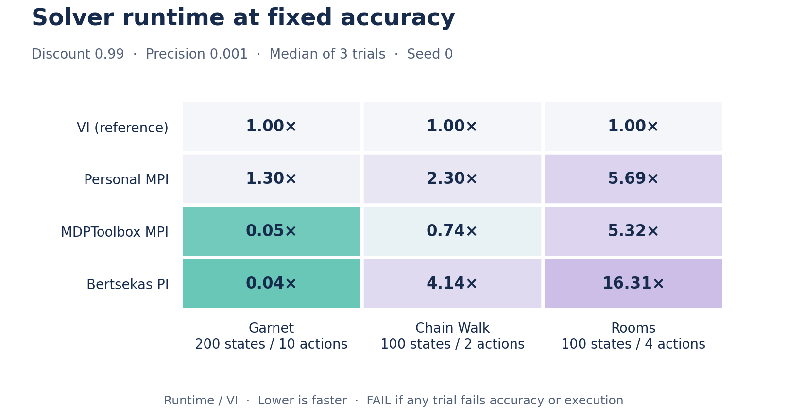

# mdpforge

**Benchmark your MDPs. Compare your solvers.**

A Python toolkit for comparing finite discounted MDP solvers at a shared target accuracy.

[](https://github.com/OrsoF/mdpforge/actions/workflows/ci.yml)
[](LICENSE)



Compare runtime at the same target accuracy. Lower is faster; `FAIL` means a
trial failed or missed the target. Discount `0.99`, precision `1e-3`, three trials,
seed `0`. Timings depend on hardware; [trial results](artifacts/results/readme_benchmark.csv).

## Install

Python 3.11+. Install from GitHub:

```sh
python -m pip install "mdpforge @ git+https://github.com/OrsoF/mdpforge.git"
```

For plotting and MDPToolbox, use `"mdpforge[plot,mdptoolbox] @ git+https://github.com/OrsoF/mdpforge.git"`.
For local development: `python -m pip install -e .`. Other [extras](pyproject.toml)
include `mdpsolver`, `gurobi`, `marmote` and `maze`.

## Run a benchmark

```python
import numpy as np
from mdpforge import Benchmark

P = [[[1, 0], [0, 1]], [[0, 1], [1, 0]]]
R = [[1, 0], [0, 2]]


def my_solver(transitions, rewards, discount, precision):
    value = np.zeros(rewards.shape[0])
    while True:
        updated = np.max(
            [rewards[:, a] + discount * (p @ value) for a, p in enumerate(transitions)],
            axis=0,
        )
        if np.max(np.abs(updated - value)) <= precision * (1 - discount):
            return updated
        value = updated


bench = Benchmark(default_solvers=False)
bench.add_mdp("rooms")  # Existing MDP
bench.add_mdp("my_mdp", transitions=P, reward=R)  # New MDP
bench.add_solver("mdpforge_mpi")  # Existing solver
bench.add_solver("my_solver", solve_function=my_solver)  # New solver

results = bench.run(discount=0.9, precision=1e-3)
bench.export_csv("results.csv")  # Also writes results.experiment.json
```

Each pair runs three trials. Results contain `runtime`, `error_bound` and `status`.
Each run has an `experiment_id`; its manifest records model configurations and
matrix fingerprints, solver options/defaults, versions, machine details and Git
provenance. Metadata is captured before timing. Model generation seeds are separate
from trial seeds; fingerprints identify the actual data, without storing matrices.
`Benchmark()` includes VI by default; use `verbose=True` to show progress.
[Explore the notebook](notebooks/benchmark.ipynb) for catalogue comparisons and plots.

Use `bench.run(discount=0.9, timeout=60)` to limit each trial to 60 seconds in
a dedicated process. The deadline includes child startup, model copying, solver
construction/execution and result transfer; parent input serialization and final
accuracy checks are outside it. A blocked trial gets `status="timeout"`, and the
remaining trials continue. Timed-out or crashed trials have `runtime=NaN`;
completed trials measure solver time without process startup or transfers.

The default `timeout=None` runs in the current process. With a timeout, use
importable solver functions/classes and pickleable models/options. In scripts,
put benchmark execution under `if __name__ == "__main__":`; in notebooks, import
custom solvers from a Python module. Cleanup may take up to two extra seconds
and terminates the worker only, not subprocesses launched by a custom solver.

## Define an MDP

For a new catalogue recipe, follow the
[model contribution requirements](docs/adding-a-model.md): scientific definition,
construction interface, metadata, size presets, reproducibility and validation.

- `transitions[action]`: an `(S, S)` matrix, dense or sparse.
- `reward[state, action]`: expected immediate rewards, shape `(S, A)`.

Dimensions, CSR conversion and validation are automatic. Use unique names;
select [catalogue models](src/mdpforge/models) by module name.
Use `from mdpforge import list_models`, then `list_models(category="navigation")`
to browse descriptions and declared references without building models.
Each recipe exposes a literal `METADATA` dict with `category`, `description`,
`reference`, `tags` and `sizes`. Each size preset contains its expected actual
`state_dim`, constructor `parameters`, and `source` (`measured`, `inferred`,
`configured`, `analytical`, `parameterized` or `unavailable`). Configured,
analytical and parameterized sizes describe dimension choices without measured
solver runtimes. Constructor inputs can differ from the resulting dimensions.
Unavailable presets have `parameters=None` and a reason. Missing tags/sizes in
new recipes default to empty collections; other missing fields are `None`.

```python
from mdpforge import Benchmark, list_models, load_model

presets = list_models(size="small", type="random")  # Metadata only
bench = Benchmark()
for model in load_model(size="small", type="random"):
    bench.add_mdp(model)
```

`load_model` returns an iterator and builds one model per iteration, using
`create_model()` and the existing matrix cache. `size` accepts `small`, `medium`
or `large`; omitted size uses constructor defaults. `type` matches a category or
a tag, including `random`, `maze`, `real-world`, `navigation` and `control`;
omitted type selects all models. `random` describes random model generation,
not merely stochastic transitions. `real-world` describes simulated applications
inspired by real systems. Unknown size/type labels raise `ValueError`.
Unavailable presets are excluded; dependency and construction errors propagate.
Use `save=False` to avoid writing newly built matrices (existing caches are read).

Calibrated presets use measurements at discount `0.99`, precision `1e-3`
and one thread. Inferred large presets aim at a 30-second solver budget with a
15-second forecast margin. These timings are hardware dependent and do not cover
failed backends or algorithms other than the measured VI variants. The existing
`utils.persistence.load_model(model)` remains the internal cache loader.

Check current presets from the repository root:

```text
conda run -n benchmark python check_model_sizes.py --dimensions-only
conda run -n benchmark python check_model_sizes.py --sizes large
```

The first command checks constructor dimensions for all three sizes without
building matrices. The second validates large matrices and measures the four
calibration solvers, sequentially, with an independent Bellman residual check.
Use `--build-only` to validate matrices without running solvers, or `--models`
to select recipes. Each stage runs in a subprocess with a 60-second timeout by
default. Results append to `artifacts/results/model_size_<mode>.csv`; reruns resume
completed cases. The modes are `dimensions`, `build` and `runtimes`.
Changed model source or settings create new cases. Use a different `--output` to
repeat unchanged cases, including after modifying a solver: backend source changes
do not invalidate completed cases. A nonzero exit code reports unavailable/failed presets
or successful solves above the 1 / 5 / 30 second size budget.
These commands read current `METADATA`, including configured presets; the older
`inferred_environment_sizes.json` is a historical calibration snapshot.

`MDP.get_config()` captures public parameters; override it for a custom configuration.
Objects that cannot be serialized are identified by type in the manifest.

## Define a solver

`solve_function(transitions, rewards, discount, precision)` returns a NumPy value
vector of length `S`. Inputs are CSR transitions and NumPy rewards; the benchmark
handles copies, timing and final accuracy checks.

Without `solve_function`, the name selects a [catalogue solver](src/mdpforge/solvers).
Custom names must be unique; extra keyword options are forwarded to the solver.

## Limitations

Experimental: APIs and the catalogue may change. Only finite discounted MDPs
(`0 < discount < 1`) are supported. Final value accuracy is checked independently;
compare runs with `status="success"`. External solvers require their optional
dependencies. MDPSolver 0.10.1 has a known VI/SOR (`mdpsolver_visor`) bug on
transient rewards; the corresponding regression test is marked as an expected
failure.

[MIT license](LICENSE).
